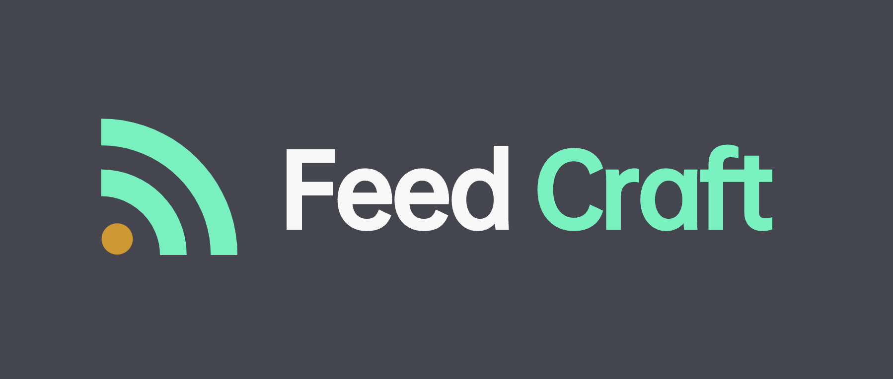

# Feed Craft

Craft all your feed in one place!


Doc: English(WIP) | 简体中文 | 繁体中文(WIP)

**FeedCraft** is a powerful tool to process your rss feeds as a middleware, use it to translate your feed, extract
fulltext, emulate browser
to render js-heavy page, use llm such as google gemini to generate brief for your rss article, use natural language to
filter your rss feed, and more!

**FeedCraft** 是一个简单、强大的RSS 源处理工具,他可以作为一个中间件处理你的RSS源.
你可以用它来翻译、提取正文、模拟浏览器来渲染那些动态生成的网页并提取全文、通过大语言模型如Google
Gemini来生成文章摘要、通过自然语言筛选文章等

## 核心特性介绍:

- 开源可自部署, 与现用任何RSS阅读器协同使用
- AI Power, 可以接入所有Open AI接口兼容的LLM对RSS进行处理, 可自定义prompt
- 支持保存规则批量应用到不同的RSS源
- 支持便携模式(portable mode, 即用即走, 只需要在原RSS地址前面加个前缀即可), 和 高级模式(dock mode,
  在后台页面自定义RSS地址和各类深度加工参数)

## 快速开始

访问以下URL格式即可快速调用FeedCraft对输入的RSS源进行指定的处理
`https://feed-craft.colinx.one/craft/{craft_atom}?input_url={input_rss_url}`

FeedCraft中的几个核心概念:

- CraftAtom(工艺), 指要如何处理一个rss源, 比如是要进行翻译,还是提取正文,还是AI生成摘要等
- CraftFlow(工艺组合), 多个craft atom组成的序列, 比如你可以定义一个新的名叫 clean-article 的 craft flow,
  将提取全文、AI筛选文章、AI摘要组合到一起,
- Recipe(食谱), 记录了以什么样的craft 或 craft flow对某个指定的rss源进行处理, 比如你可以指定一个名叫my-zhihu-daliy的recipe,
  对知乎日报的rss自动进行AI生成摘要的操作, 这个recipe对应一个新的rss地址, 你可以直接订阅这个地址得到带摘要版本的知乎日报

你可以先开始尝试下面的几个工艺(craft atom):

- **proxy**: 简易RSS代理, 不作任何处理.
- **limit**: 限制文章个数, 默认最新10个
- **fulltext**: 获取全文
- **fulltext-plus**: 获取全文,但是会模拟浏览器渲染网页,适用于常规模式无法获取到文章内容,动态渲染内容的站点
- **introduction**: 调用AI为文章生成摘要,附加在原文开头
- **translate-title**: 调用AI翻译文章标题
- **translate-content**: 调用AI翻译文章内容
- **ignore-advertorial**: 调用AI对文章进行筛选, 排除营销软文

你可以使用提供的demo站点快速开始体验 :
https://feed-craft.colinx.one

例如, 现在你想要阅读这个RSS源 `https://feeds.feedburner.com/visualcapitalist`, 但是由于是全英文的不方便快速略读,
使用FeedCraft对标题进行翻译,
那么只需要将订阅地址改成
`https://feed-craft.colinx.one/craft/translate-title?input_url=https://feeds.feedburner.com/visualcapitalist`  即可.

(部分RSS订阅软件不会自动进行字符转义, 你可能需要把 input_url 后面的内容进行手动转义,
结果为 `https://feed-craft.colinx.one/craft/translate-title?input_url=https%3A%2F%2Ffeeds.feedburner.com%2Fvisualcapitalist` )

*注意: Demo站点仅供体验使用

## 部署

你可以通过docker快速自行部署一个FeedCraft实例,以获得更好的使用体验.
下面为一个最小docker compose 示例:

服务默认监听在 80 端口，你也可以在同一网络下的其他容器中，使用 `http://app.feed-craft/xxx` 这样来进行访问。  
控制台默认账号`admin`, 密码 `adminadmin`, 登陆后请尽快修改默认密码

```yaml
version: "3"
services:
  app.feed-craft:
    image: ghcr.io/colin-xkl/feed-craft
    container_name: feed-craft
    restart: always
    ports:
      - "10088:80"  # 10088可替换为任何你想使用的端口
    volumes:
      - ./feed-craft-db:/usr/local/feed-craft/db # db file
    environment:
      FC_PUPPETEER_HTTP_ENDPOINT: http://service.browserless:3000 # 替换为你自己的 browserless 或其他浏览器实例地址
      FC_REDIS_URI: redis://service.redis:6379/ # 替换为你自己的redis 实例地址
      FC_OPENAI_AUTH_KEY: skxxxxxx # 鉴权的key
      FC_OPENAI_DEFAULT_MODEL: gemini-pro/chatgpt-3.5/... # 默认使用的模型
      FC_OPENAI_ENDPOINT: https://xxxxxx # OPENAI API 或兼容平台的API接口路径
```

你也可以直接在一个compose文件中把redis等附加组件也一起部署好:

```yaml
version: "3"
services:
  app.feed-craft:
    image: ghcr.io/colin-xkl/feed-craft
    container_name: feed-craft
    restart: always
    ports:
      - "10088:80"  # 10088可替换为任何你想使用的端口
    volumes:
      - ./feed-craft-db:/usr/local/feed-craft/db # db file
    environment:
      FC_PUPPETEER_HTTP_ENDPOINT: http://service.browserless:3000 # 替换为你自己的 browserless 或其他浏览器实例地址
      FC_REDIS_URI: redis://service.redis:6379/ # 替换为你自己的redis 实例地址
      FC_OPENAI_AUTH_KEY: skxxxxxx # 鉴权的key
      FC_OPENAI_DEFAULT_MODEL: gemini-pro/chatgpt-3.5/... # 默认使用的模型
      FC_OPENAI_ENDPOINT: https://xxxxxx # OPENAI API 或兼容平台的API接口路径
  service.redis:
    image: redis:6-alpine
    container_name: feedcraft_redis
    restart: always
  service.browserless:
    image: browserless/chrome
    container_name: feedcraft_browserless
    environment:
      USE_CHROME_STABLE: true
    restart: unless-stopped
```

## 关于FeedCraft

FeedCraft 的名称和Logo参考并致敬两款游戏: MineCraft和塞尔达, 初衷和愿景是做一个简单易用、同时足够灵活, 能够有更多可能性的RSS工具.
使用问题、建议等欢迎在Discussion区讨论交流

## RoadMap

- [x] common openai api calling
- [x] translate article and title
- [x] feed limit support
- [x] feed natural language filter support
- [x] craft flow
- [x] feed custom keyword filter support
- [ ] feed merge support

## 测试用例

你可以使用下面几个 rss 快速进行测试

- 全英文，有全文
  https://feeds.feedburner.com/visualcapitalist

- 全英文，无全文
  https://ourworldindata.org/atom.xml

## 许可

GPLv3

## 页面展示

**欢迎页**


**RSS源比较工具**
你可以输入一个RSS 源的地址, 然后选择要使用的craft atom, 就可以看到前后的对比.
如下图我应用的craft是自定义的, 只显示文章标题带有`RSS`的文章, 可以看到筛选后的结果少了很多


**创建Craft Atom 自定义Prompt**


**自定义recipe, 指定使用哪个craft atom 处理哪个RSS源**


