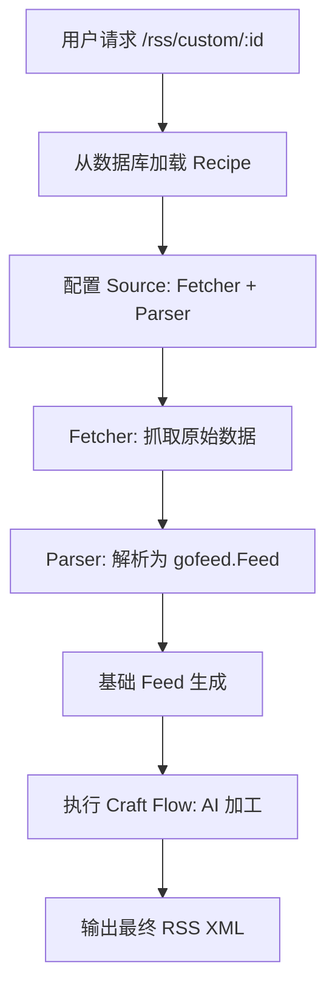

# FeedCraft 项目基础架构说明 (Current Architecture)

> 类型：说明文档

本文档旨在整理 FeedCraft 当前的核心架构设计，涵盖从数据抓取到 AI 增强处理的完整流水线。

## 1. 核心定位

FeedCraft 是一个基于 Go 开发的 RSS 订阅源增强中间件，支持将网页 (HTML)、API (JSON) 和搜索结果转换为标准 RSS，并利用大语言模型 (LLM) 进行全文提取、摘要、翻译等二次加工。

## 2. 核心架构组件

### 2.1 数据生成层 (Source Layer)

数据生成层是系统的核心，负责从各种非标准来源提取数据并生成标准 RSS 对象。它主要通过 `Source` 接口及其工厂函数进行构建。

#### 2.1.1 核心组件关系

- **PipelineSource**: 通用容器，持有 `Fetcher` 和 `Parser`。
- **Fetcher**: 处理网络 I/O，支持 HTTP 请求（包含 Headers, Body, Method 配置）和无头浏览器（Browserless）渲染。
- **Parser**: 处理内容提取逻辑。

#### 2.1.2 模块构建说明

| 模块              | 构建方式 (Factory)    | 核心组件                       | 提取技术               |
| :---------------- | :-------------------- | :----------------------------- | :--------------------- |
| **HTML-to-RSS**   | `htmlSourceFactory`   | `HttpFetcher` + `HtmlParser`   | CSS 选择器 (`goquery`) |
| **CURL-to-RSS**   | `jsonSourceFactory`   | `HttpFetcher` + `JsonParser`   | JQ 表达式 (`gojq`)     |
| **Search-to-RSS** | `searchSourceFactory` | `SearchFetcher` + `JsonParser` | 供应商 API + JQ        |

#### 2.1.3 具体实现与数据流

**1. HTML-to-RSS (网页转 RSS)**

- **构建**: 接收 `HttpFetcherConfig`（目标 URL、是否开启无头浏览器）和 `HtmlParserConfig`（列表项选择器、标题/链接/内容等字段选择器）。
- **数据流**:
  1.  `HttpFetcher` 根据配置请求网页（如开启 Browserless 则通过 Chromium 渲染）。
  2.  返回网页 HTML 源码 (`[]byte`)。
  3.  `HtmlParser` 加载源码，使用 CSS 选择器遍历 DOM。
  4.  提取每条项目的核心字段，封装为 `gofeed.Item`。

**2. CURL-to-RSS (JSON API 转 RSS)**

- **构建**: 接收完整的 HTTP 请求配置（方法、Headers、JSON Body）和 `JsonParserConfig`（基于 JQ 的路径配置）。
- **数据流**:
  1.  `HttpFetcher` 执行精确的 API 调用。
  2.  返回原始 JSON 数据。
  3.  `JsonParser` 使用 `gojq` 执行查询。
  4.  首先运行 `ItemsIterator` 获取条目数组，然后对每个条目运行子查询（Title, Link 等）提取数据。

**3. Search-to-RSS (搜索转 RSS)**

- **标准模式构建**: 组合 `SearchFetcher`（封装了 SearXNG/Google/Bing 的 API 调用）和 `JsonParser`。
- **增强模式构建 (`EnhancedSearchSource`)**: 这是一个特殊的装饰器模式。
- **数据流 (增强模式)**:
  1.  **AI 扩展**: 将原始查询发送给 LLM，生成 3-5 个优化后的搜索词。
  2.  **并发执行**: 为每个搜索词创建一个标准的 `SearchSource` 实例，并利用 Goroutine 并发执行。
  3.  **合并去重**: 收集所有结果，根据 URL 链接进行全局去重。
  4.  **生成 Feed**: 构建包含所有结果的最终 Feed 对象。

### 2.2 数据加工层 (Craft Layer)

对生成的 Feed 进行后处理，主要依赖 AI 能力：

- **AtomCraft (原子加工单元)**:
  - `fulltext`: 使用 `go-readability` 提取正文。
  - `summary`: 使用 LLM 生成内容摘要。
  - `translate`: 支持沉浸式翻译、多语言翻译。
  - `adfilter`: AI 智能过滤广告内容。
- **FlowCraft (加工流)**: 将多个原子单元按顺序组合（例如：全文提取 -> 摘要 -> 翻译）。

### 2.3 业务管理层 (Recipe Layer)

**Recipe (配方)** 是系统的核心管理单元，它在数据库中持久化了以下配置：

1.  **Source Config**: 定义如何获取和解析数据。
2.  **Craft Flow**: 定义数据获取后的 AI 加工步骤。
3.  **Metadata**: 自定义订阅源的标题、描述、作者等信息。

## 3. 数据流转关系 (Data Flow)

## 4. 技术栈总结

- **核心语言**: Go 1.24.4
- **Web 框架**: Gin
- **解析引擎**: `goquery` (HTML), `gojq` (JSON), `gofeed` (RSS)
- **数据库/缓存**: SQLite (GORM) / Redis
- **AI 集成**: 支持 OpenAI, Ollama, DeepSeek 等多种模型协议
- **前端/文档**: Astro (doc-site)
