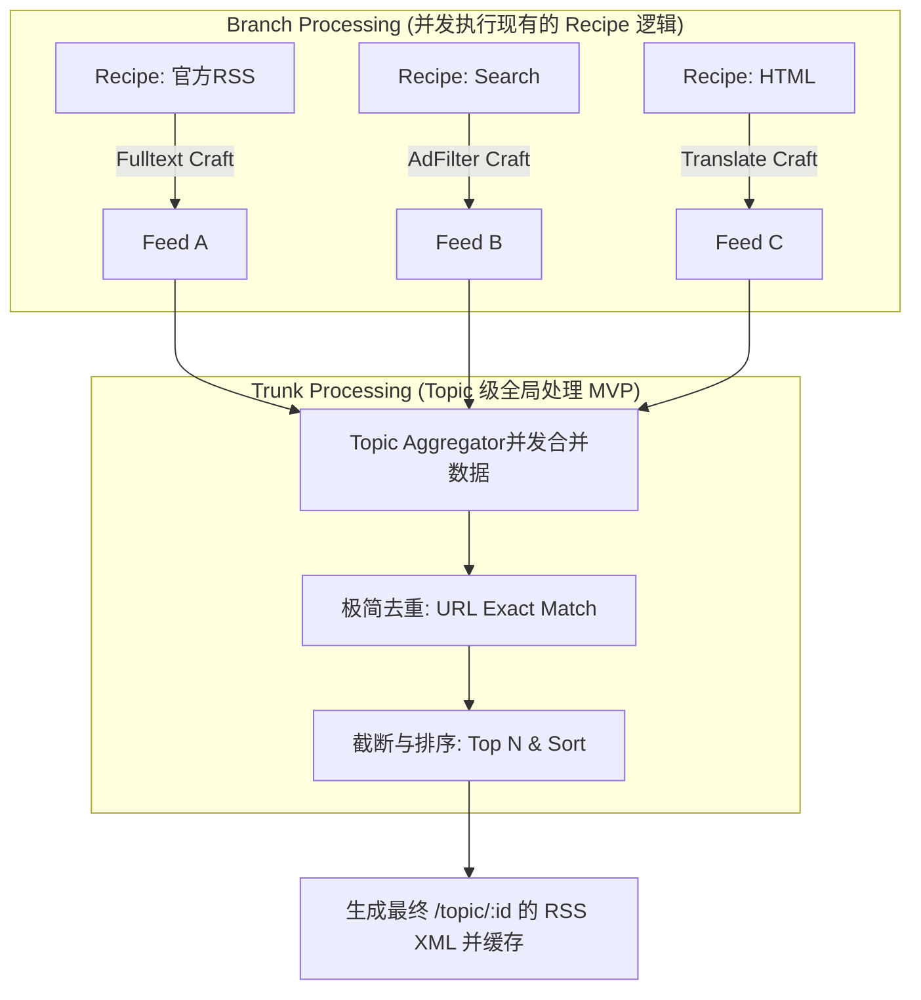

# 主题聚合与统一分发设计方案 (Topic Aggregation Design)

## 1. 业务场景与需求定义 (Scenario & Requirements)

### 1.1 核心需求描述
系统需要支持用户围绕特定领域或主题建立订阅内容的“聚合池”，并从多种渠道、通过多种方式获取信息，经过处理后，最终通过统一的 Endpoint 对外输出。

### 1.2 典型业务场景案例：构建“热门自托管应用”主题
假设用户希望构建并订阅一个关于 `popular-selfhost-app-for-home-server`（家用服务器热门自托管应用）的主题。

为构建此主题，数据的获取与处理流程如下：
1. **多渠道数据获取 (Multi-channel Sourcing)**：
   - **渠道 A (官方 RSS)**: 从官方网站直接获取 RSS。（部分可能需要 `fulltext` 预处理）。
   - **渠道 B (关键词搜索)**: 使用 `search-to-rss` 模块获取相关最新文章。
   - **渠道 C (网页抓取)**: 使用 `html-to-rss` 功能将未提供 RSS 的博客转换为 RSS。

2. **内容合并与极简去重 (Aggregation & MVP De-duplication)**：
   - 将上述渠道获取到的所有文章内容汇总合并。
   - **基础去重**: 仅基于文章 URL 或 `OriginalID` 进行精确的内存去重。（*注：更高级的文本相似度、LLM 语义去重策略目前已延后至未来实现，详见 `proposal/future/advanced_deduplication.md`*）。

3. **统一输出与订阅 (Unified Endpoint)**：
   - 经过清洗、合并、去重、截断后的内容集合，通过统一的 Endpoint 输出。
   - 订阅链接形如：`<feed-craft-server-app-addr>/topic/popular-selfhost-app`。

## 2. 核心架构升级：引入 Topic 层
在现有的 `Recipe`（单源配方）之上，引入 `Topic` 层，形成两级流水线架构：**分支处理 (Branch)** 与 **全局处理 (Trunk)**。

### 2.1 实体模型 (Data Model)
新增 `Topic` 实体存储在数据库中（MVP 版本）：
```go
type Topic struct {
    TopicID     string      `gorm:"primaryKey"` // e.g., "popular-selfhost-app"
    Title       string
    Description string
    RecipeIDs   []string    `gorm:"type:json"`  // 关联的底层数据源配方列表
    Limit       int         // 数据截断：保留 Top N 条（例如 50）
    SortBy      string      // 排序策略：如 "time" (时间倒序), "quality" (基础质量打分)
    // TopicCrafts []string `gorm:"type:json"`  // MVP阶段暂不引入复杂的全局Craft(如AI评估)，此字段先作预留
}
```

### 2.2 数据流向 (Data Flow)



## 3. 核心设计要点 (Key Design Decisions)

### 3.1 内部数据模型的统一 (前置重构需求)
系统内部定义 `CraftItem` 和 `CraftFeed`，避免底层 Recipe 直接依赖 `gofeed.Feed` 进行传递，否则在内存中进行属性（如 URL、全文标记）判断和排序截断时会非常不便。

### 3.2 聚合器 (Topic Aggregator) 的实现
`Topic Aggregator` 作为协调者 (Orchestrator)：
*   **并发拉取**：使用 Go 的 `errgroup` 并发调用底层配置的 `RecipeIDs`。
*   **容错机制 (MVP)**：设置局部超时时间。若某个 Recipe 获取失败，聚合器仅打印 Warn 日志并忽略该源，继续合并其余成功的数据，不阻塞整体 Topic 的输出。（*注：完善的错误状态记录与可观测性看板功能延后，详见 `proposal/future/error_handling_and_observability.md`*）。

### 3.3 极简去重与排序截断 (Deduplication & Truncation)
*   **极简去重 (Deduplication)**：当前仅实现基于 URL 的精确匹配去重。在内存中使用 `map[string]bool` 过滤重复项。代码层面需抽象出 `Deduplicator` 接口，以便未来无缝接入更复杂的去重实现。
*   **排序与截断 (Truncation)**：多源合并会导致数据量暴增，必须在输出前根据 `Topic.Limit` 进行截断（保留 Top N）。
    *   MVP 排序逻辑：优先按时间倒序保留最新内容；如果配置了按照 `quality` 排序，则采用极简的二元打分逻辑（带有全文内容 `Content/Description` 丰富的算作高质量，排在前面）。（*注：复杂的 AI 多维质量打分模型延后，详见 `proposal/future/article_quality_scoring.md`*）。

## 4. 执行策略与状态管理 (Execution Strategy)

在 MVP 阶段，我们采用 **“极简 TTL 缓存 + 实时并发拉取”** 策略，不引入复杂的异步 Topic 预热计算和持久化指纹库。

1.  **TTL 快照缓存 (TTL Cache)**：
    *   设定一个固定的有效时长常量（例如 `TopicCacheTTL = 1 * time.Hour`）。
    *   将 Topic 最终经过处理和截断的 XML 结果整体缓存入 Redis。
2.  **实时并发拉取机制**：
    *   当用户访问 `/topic/:id` 时，优先检查缓存。
    *   若缓存未过期，直接返回。
    *   若缓存已失效（冷启动或过期），则**同步触发**实时聚合：并发调用底层的所有 Recipe。
    *   **性能保障**：虽然是同步聚合，但底层的单源 `Recipe` 自身具备需求驱动的智能预热缓存机制。因此，这几个 Recipe 的获取大概率是秒级返回缓存，整体 Topic 实时聚合的耗时依然可控。

## 5. 接口与分发设计
*   **路由**：`GET /topic/:topic_id`
*   **处理逻辑**：
    1. 查 Redis 缓存，命中且在 TTL 内，则直接返回 XML。
    2. 无缓存或已过期：并发调用关联的所有 Recipe 获取 `CraftFeed`。
    3. 内存处理：合并合集 -> 过滤去重 (URL) -> 排序打分 -> 截断 (Top N)。
    4. 将最新生成的完整 XML 存入 Redis 并重置 1h TTL。
    5. 响应客户端。

## 6. 未来的演进路线 (Evolution Path)
所有在 MVP 阶段被剥离或简化的复杂特性，均已整理至 `proposal/future/` 目录下备忘：
1. `advanced_deduplication.md`: 高级去重策略（向量化检索与 LLM 判定）
2. `article_quality_scoring.md`: 文章质量打分模型（多维度与 AI 评估）
3. `error_handling_and_observability.md`: 错误处理与可观测性（系统通知与健康度监控）