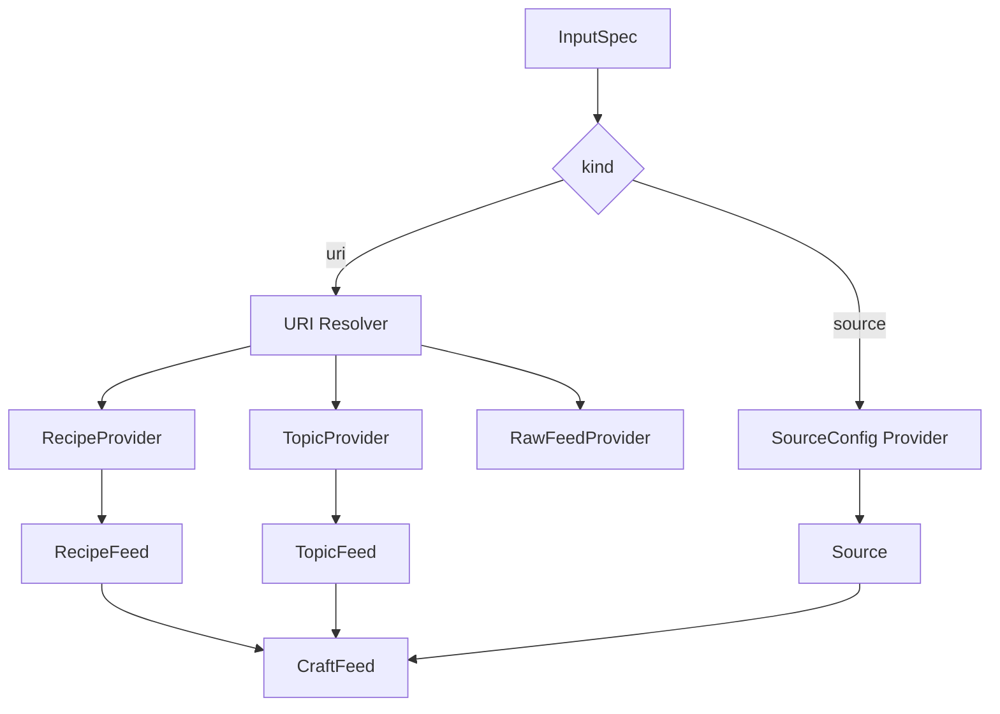
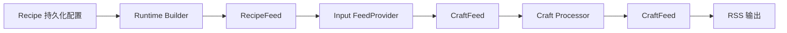
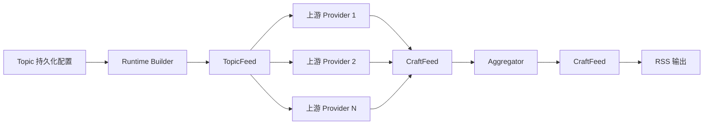
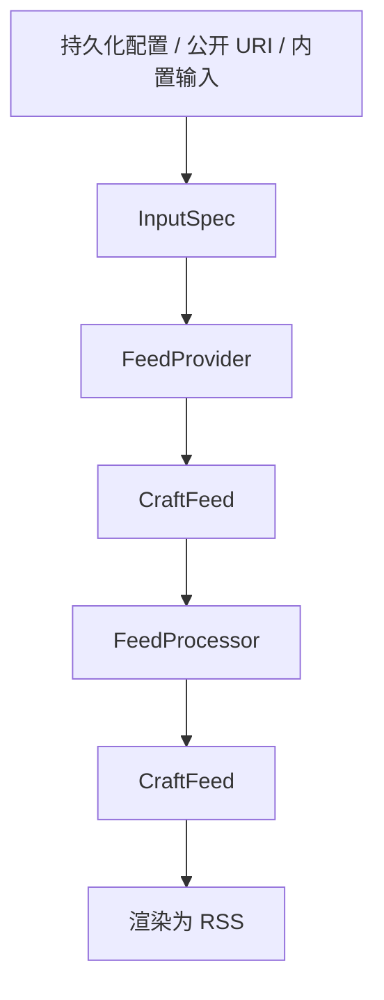

# Feed Runtime 核心概念与数据流

本文档整理 FeedCraft 当前运行时中的几个核心概念：

- `InputSpec`
- `FeedProvider`
- `FeedProcessor`
- `CraftFeed`
- `RecipeFeed`
- `TopicFeed`

目标是回答三个问题：

1. 系统内部的统一输入模型是什么
2. 数据在运行时中如何流动
3. 新代码应当落在哪一层

## 1. 设计目标

FeedCraft 的长期目标不是继续维护多套并行执行流，而是把核心链路收敛为一条统一的数据流：

```text
InputSpec -> FeedProvider -> FeedProcessor -> CraftFeed
```

这条链路有两个直接价值：

- `RecipeFeed` 与 `TopicFeed` 可以在引擎层面平级
- Source、Craft、Topic 聚合都围绕同一份内部数据模型工作

## 2. 核心概念

### 2.1 InputSpec

`InputSpec` 是运行时的统一输入模型。它描述的是“输入来自哪里”，而不是“底层如何抓取”。

当前定义位于：

- `internal/feedruntime/builder.go`

当前支持两种形态：

- `kind=uri`
- `kind=source`

示意：

```go
type InputSpec struct {
    Kind         InputKind
    URI          string
    SourceConfig *config.SourceConfig
}
```

两种形态的职责不同：

- `kind=uri`
  - 用于轻量引用
  - 适合表达内部资源和简单外部地址
- `kind=source`
  - 用于直接承载复杂 `SourceConfig`
  - 适合 HTML、JSON、Search、curl-to-rss 这类需要完整抓取与解析配置的输入

### 2.2 FeedProvider

`FeedProvider` 表示一个“可以产出 `CraftFeed` 的节点”。

接口定义位于：

- `internal/engine/interfaces.go`

```go
type FeedProvider interface {
    Fetch(ctx context.Context) (*model.CraftFeed, error)
}
```

常见的 `FeedProvider`：

- 原始外部输入
  - RSS / HTML / JSON / Search Source
  - `RawFeedProvider`
- 组合后的单输入节点
  - `RecipeFeed`
- 多输入聚合节点
  - `TopicFeed`

判断一个对象是否属于 `FeedProvider`，关键看它是否“负责产出 feed”，而不是它是否做了抓取。

### 2.3 FeedProcessor

`FeedProcessor` 表示一个“接收 `CraftFeed` 并返回新 `CraftFeed` 的处理节点”。

接口定义位于：

- `internal/engine/interfaces.go`

```go
type FeedProcessor interface {
    Process(ctx context.Context, feed *model.CraftFeed) (*model.CraftFeed, error)
}
```

典型的 `FeedProcessor`：

- AtomCraft 对应的处理器
  - `proxy`
  - `limit`
  - `cleanup`
  - `fulltext`
  - `summary`
- FlowCraft 对应的处理链
- Topic 聚合中的聚合器
  - 去重
  - 排序
  - 限量

判断一个对象是否属于 `FeedProcessor`，关键看它是否“处理 feed”，而不是它是否依赖 LLM 或网络。

### 2.4 CraftFeed

`CraftFeed` 是运行时中的统一内部数据载体。

定义位于：

- `internal/model/feed.go`

`CraftFeed` 承载：

- feed 元信息
  - `Title`
  - `Link`
  - `Description`
  - `Updated`
  - `Id`
- 文章列表
  - `Articles []*CraftArticle`

`CraftArticle` 承载单篇文章的标准字段与运行时元数据，例如：

- `Title`
- `Link`
- `Description`
- `Content`
- `Id`
- `QualityScore`
- `OriginalFeedID`

当前系统内部应优先围绕 `CraftFeed` 工作。`feeds.Feed` 和 `gofeed.Feed` 只应保留在兼容边界和格式转换边界。

## 3. URI 语义

当 `InputSpec.kind=uri` 时，当前运行时支持以下 URI 语义：

- `feedcraft://recipe/:id`
- `feedcraft://topic/:id`
- `http://...`
- `https://...`

它们的含义分别是：

- `feedcraft://recipe/:id`
  - 引用一个已有 `RecipeFeed`
- `feedcraft://topic/:id`
  - 引用一个已有 `TopicFeed`
- `http(s)://...`
  - 视为第三方网站的 RawFeed 输入
  - 语义等价于“一个最小输入源”，用于接入外部站点内容

这条规则是系统级规则，而不是 `TopicFeed` 的专属特例。

## 4. 运行时装配

`InputSpec` 不直接执行。真正的执行发生在 runtime builder 将输入编译为 `FeedProvider` 之后。

当前装配入口位于：

- `internal/feedruntime/builder.go`

核心职责：

- 将 `InputSpec` 编译为 `FeedProvider`
- 将持久化的 `Recipe` 编译为 `RecipeFeed`
- 将持久化的 `Topic` 编译为 `TopicFeed`
- 为 `TopicFeed` 构建聚合处理器
- 处理递归引用与循环依赖检测

### 4.1 装配关系图



## 5. RecipeFeed 与 TopicFeed

### 5.1 RecipeFeed

`RecipeFeed` 是单输入节点。

当前结构位于：

- `internal/engine/recipe.go`

可以把它理解为：

```text
RecipeFeed = 一个输入 FeedProvider + 一个可选 FeedProcessor
```

它的职责很单纯：

1. 先从输入节点取到原始 `CraftFeed`
2. 再把结果交给 craft processor 链处理

它不关心输入来自 RSS、HTML、JSON、Search，还是未来的其他输入源。

### 5.2 TopicFeed

`TopicFeed` 是多输入聚合节点。

当前结构位于：

- `internal/engine/topic.go`

可以把它理解为：

```text
TopicFeed = 多个输入 FeedProvider + 一个可选聚合处理器
```

它的职责是：

1. 并发拉取多个上游输入
2. 合并文章列表
3. 执行聚合处理
4. 输出一个新的 `CraftFeed`

`TopicFeed` 与 `RecipeFeed` 的差异，不在于数据模型，而在于执行形态：

- `RecipeFeed` 偏单源加工
- `TopicFeed` 偏多源聚合

## 6. 整体数据流

### 6.1 Recipe 数据流



说明：

- `Recipe` 的输入目前通常来自 `SourceConfig`
- builder 会把它映射成一个可执行输入节点
- craft 链以 `FeedProcessor` 形式作用在 `CraftFeed` 上

### 6.2 Topic 数据流



说明：

- 上游既可以是 `RecipeFeed`，也可以是另一个 `TopicFeed`
- 也可以是外部 `http(s)` RawFeed
- 聚合器本质上也是 `FeedProcessor`

### 6.3 系统视角下的统一数据流



这张图表达了一个关键约束：

- `InputSpec` 负责描述输入
- `FeedProvider` 负责产出 feed
- `FeedProcessor` 负责处理 feed
- `CraftFeed` 是中间统一载体

## 7. 分层建议

后续代码编写时，建议按以下边界落位。

### 7.1 输入层

适合放在这一层的内容：

- `InputSpec`
- URI 解析
- `SourceConfig` 到 provider 的映射
- 内部资源引用解析

不适合放在这一层的内容：

- 文章处理逻辑
- 聚合处理逻辑
- RSS 渲染

### 7.2 Provider 层

适合放在这一层的内容：

- 产出 `CraftFeed`
- 拉取上游数据
- 聚合多个输入
- 组合单输入与处理链

不适合放在这一层的内容：

- 纯内容加工
- 展示层格式转换

### 7.3 Processor 层

适合放在这一层的内容：

- 限量
- 过滤
- 去重
- 排序
- 正文提取
- 翻译
- 总结

判断标准很简单：

- 如果它接收一个 `CraftFeed` 并产出一个新的 `CraftFeed`，它就应当优先被建模为 `FeedProcessor`

### 7.4 输出边界

RSS XML、HTTP 响应、Admin 预览等都属于输出边界。

边界层的职责是：

- 调用 runtime
- 处理错误
- 将 `CraftFeed` 转换为对外格式

边界层不应重新实现执行逻辑，也不应重复装配 provider graph。

## 8. 当前实现约定

在当前代码中，可以默认采用以下约定：

- 统一内部数据模型使用 `CraftFeed`
- 新增运行时输入优先考虑是否应抽象为 `InputSpec`
- 新增可执行节点优先考虑是否应实现 `FeedProvider`
- 新增内容处理逻辑优先考虑是否应实现 `FeedProcessor`
- `RecipeFeed` 与 `TopicFeed` 是运行时的一等节点
- `http(s)` 输入默认按外部 RawFeed 处理

## 9. 对后续实现的直接指导

如果后续新增一个能力，可以先用下面这组问题判断应该落在哪一层。

### 9.1 它描述的是输入来源吗

如果是，应优先考虑：

- 是否属于新的 `InputSpec` 语义
- 是否属于 `InputSpec.kind=source` 下的新配置能力

### 9.2 它会产出一个 feed 吗

如果是，应优先考虑实现：

- `FeedProvider`

### 9.3 它只是对 feed 做变换吗

如果是，应优先考虑实现：

- `FeedProcessor`

### 9.4 它只是把结果输出给外部吗

如果是，应优先考虑放在：

- controller
- render helper
- preview DTO

而不是再去改 runtime 主链路。

## 10. 一句话总结

FeedCraft 当前的统一运行时，可以概括为一句话：

> 用 `InputSpec` 描述输入，用 `FeedProvider` 产出 feed，用 `FeedProcessor` 处理 feed，用 `CraftFeed` 贯穿整个执行链路。
